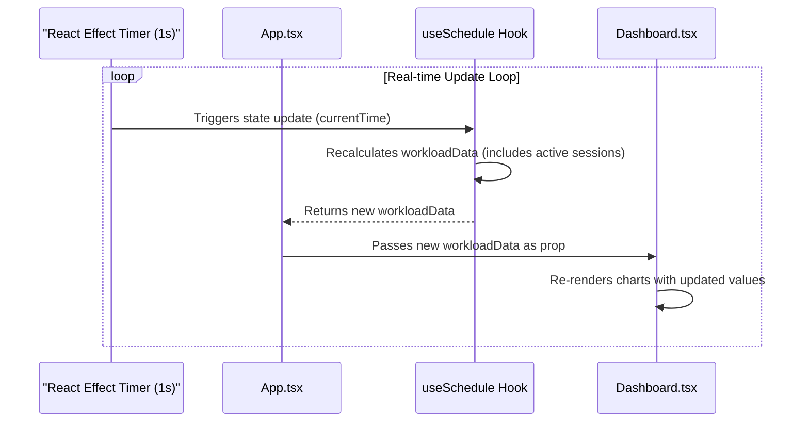
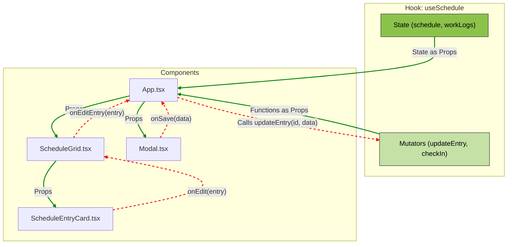
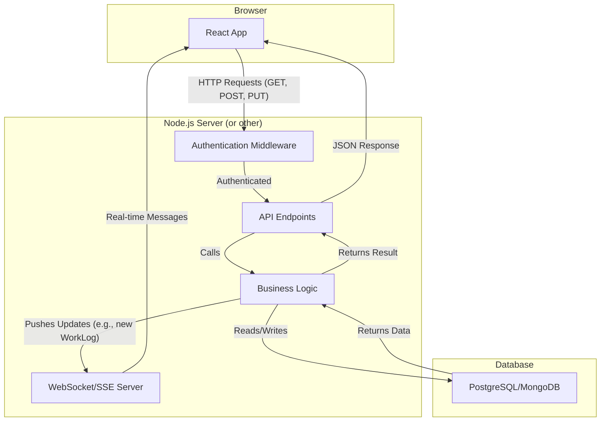

<div align="center">

<h1>Gestor de Grade Horária</h1>
  
    
  <p>
    
    
    
  </p>
</div>

Uma aplicação web sofisticada e rica em funcionalidades para gerenciar horários de professores, rastrear horas de trabalho em tempo real e visualizar dados de desempenho. Construída com uma stack de tecnologia moderna, esta aplicação oferece uma experiência de usuário altamente interativa e responsiva, projetada para otimizar o planejamento operacional.

<div>

<div>

## ✨ Funcionalidades Inovadoras

*   **Grade Horária Semanal Interativa:** Uma grade responsiva exibindo todas as aulas e turnos de trabalho, que se repetem de forma consistente a cada semana.
*   **Agendamento Automatizado de Supervisão:** Atribui e visualiza automaticamente os turnos de supervisão de "Horário Livre", garantindo a responsabilidade pela supervisão das instalações e equipamentos.
*   **Modo Foco na Grade:** Uma visualização em tela cheia e sem distrações da grade de horários, perfeita para um planejamento detalhado.
*   **Filtragem por Professor:** Filtre instantaneamente a grade para visualizar as aulas de um professor específico.
*   **Layout Dinâmico de Eventos:** Lida de forma inteligente com eventos sobrepostos e exibe informações-chave rapidamente, incluindo o tipo de aula e a lista de nomes dos professores atribuídos.
*   **Check-in/Check-out em Tempo Real:** Professores podem registrar a entrada e saída, com seu status e duração do trabalho atualizados ao vivo.
*   **Sincronização em Tempo Real do Dashboard:** O painel de desempenho é atualizado a cada segundo, refletindo as horas de sessões de trabalho concluídas e em andamento.
*   **Registro de Trabalho Não Planejado:** Cria automaticamente entradas na grade para check-ins que não correspondem a uma aula planejada, garantindo que todo o trabalho seja contabilizado visualmente.
*   **Edição Rica de Dados:** Edição de horários no local através de popovers e edição detalhada através de modais.
*   **Notificações Toast:** Um sistema de notificação elegante e não intrusivo para feedback do usuário sobre ações e erros.
*   **Modo Claro & Escuro:** Uma interface de usuário moderna e elegante com um tema escuro alternável pelo usuário, que é o padrão.
*   **✨ NOVO: PlanMode - Camada de Planejamento Estratégico:** Um novo modo que transforma a aplicação em uma plataforma de planejamento proativo.
    *   **Propostas de Grade:** Crie, gerencie e analise múltiplos rascunhos de grades horárias sem impactar a visualização operacional ao vivo.
    *   **Perfis de Capacidade:** Defina a disponibilidade detalhada, restrições e preferências para cada professor.
    *   **Análise Preditiva:** Análise de conflitos em tempo real e balanceamento da carga de trabalho para as grades propostas.

---

## 🚀 Guia de Execução

Esta é uma aplicação de página única do lado do cliente. Nenhum passo de compilação é necessário.

1.  Clone o repositório.
2.  Abra o arquivo `index.html` em seu navegador.

---

## 🚀 Tecnologias de Ponta

*   **Biblioteca Frontend:** React 19
*   **Linguagem:** TypeScript
*   **Estilização:** Tailwind CSS (configurado diretamente em `index.html`) com um tema personalizado para cores e modo escuro.
*   **Gráficos:** Recharts para visualização de dados.
*   **Ícones:** Um conjunto personalizado de ícones SVG como componentes React.
*   **Gerenciamento de Estado:** Um hook React personalizado (`useSchedule`) serve como a solução centralizada de gerenciamento de estado.

---

## 📂 Estrutura de Arquivos

O projeto é organizado para promover a separação de responsabilidades, tornando-o escalável e de fácil manutenção.

```
/
├── components/      # Componentes React reutilizáveis
│   ├── icons.tsx    # Ícones SVG como componentes
│   └── ...          # Todos os outros componentes de UI
├── docs/            # Arquivos de documentação
├── hooks/           # Hooks React personalizados para estado e lógica
│   └── useSchedule.ts # Gerenciamento de estado central
├── services/        # Busca de dados e lógica de negócios
│   └── api.ts       # API de backend simulada (mock)
├── index.html       # Ponto de entrada HTML principal
├── index.tsx        # Raiz da aplicação React
├── types.ts         # Definições de tipo TypeScript
└── README.md        # Você está aqui
```

---

## 🎨 Filosofia de Design UI/UX

O design da aplicação é focado na clareza, eficiência e uma estética moderna.

### Estética Dark-First de Alto Contraste

*   **Modo Escuro Padrão:** O aplicativo usa um tema escuro por padrão para reduzir a fadiga ocular em condições de iluminação típicas de escritórios ou residências. A paleta de cores (`charcoal-black`, `army-olive`, `lime-green`) foi escolhida para criar uma interface profissional, calma e visualmente marcante.
*   **Alto Contraste:** O vibrante `lime-green` atua como uma cor de destaque principal, chamando a atenção para ações-chave e estados ativos, garantindo excelente legibilidade contra os fundos escuros.

### Responsividade & Acessibilidade

*   **Abordagem Mobile-First:** O layout é construído com a responsividade em mente, garantindo uma experiência perfeita desde monitores de desktop grandes até dispositivos móveis.
*   **Acessibilidade (a11y):** Elementos semânticos do HTML5 (`button`, `header`, `main`) e atributos ARIA (`aria-label`, `aria-expanded`) são usados em toda a aplicação para garantir que ela seja navegável e compreensível para usuários de tecnologias assistivas.

### Divulgação Progressiva

Para evitar sobrecarregar o usuário, a UI emprega uma estratégia de "divulgação progressiva".

*   **Grade de Horários:** Mostra informações essenciais de relance.
*   **Popovers:** Ações rápidas e contextuais, como editar o horário de um evento, são tratadas em pequenos popovers que não interrompem o fluxo de trabalho do usuário.
*   **Modais:** Operações mais complexas, como editar todos os detalhes de uma aula ou adicionar um registro de trabalho manual, são tratadas em modais completos que exigem a atenção total do usuário.

### Padronização de Componentes

*   **Controles Consistentes:** Para fornecer uma experiência de usuário coesa и previsível, todas as tarefas de seleção de data e hora são tratadas por um conjunto padronizado de componentes de popover. Os seletores de data/hora nativos do navegador foram substituídos por controles personalizados e cientes do tema (`CalendarPopover`, `WheelTimePickerPopover`) que garantem uma aparência consistente em todas as plataformas.
*   **Seleção Ergonômica de Horário:** O componente `WheelTimePicker` foi escolhido como padrão para a entrada de tempo devido à sua excelente usabilidade tanto em dispositivos de toque quanto baseados em mouse, oferecendo uma alternativa moderna e intuitiva à entrada de texto.

---

## ⚙️ Arquitetura Detalhada

A aplicação é arquitetada para ser robusta, escalável e pronta para uma transição para um backend real. É construída sobre uma clara separação das camadas de visualização, gerenciamento de estado e serviço.

### A Camada de Serviço da API (`services/api.ts`)

Este arquivo atua como a **única fonte de verdade** para todas as interações de dados. Ele simula perfeitamente uma API de backend.

*   **Desacoplamento:** Componentes e hooks **nunca** modificam os dados diretamente. Eles chamam funções de `api.ts` (ex: `fetchInitialData`, `updateEntry`). Isso significa que a API mock pode ser substituída por requisições HTTP reais (ex: usando `fetch` ou `axios`) sem alterar qualquer outra parte da aplicação.
*   **Simulação Assíncrona:** Cada função retorna uma `Promise` e usa um `delay` para simular a latência da rede, garantindo que a UI seja construída para lidar com estados de carregamento e erro do mundo real de forma graciosa.
*   **Imutabilidade:** Todas as funções de mutação de dados são projetadas para serem imutáveis, criando novas estruturas de dados em vez de modificá-las no local. Isso previne efeitos colaterais e garante um fluxo de gerenciamento de estado previsível e confiável.

### Gerenciamento de Estado: O Hook `useSchedule`

Para uma aplicação desta escala, um hook React personalizado fornece uma solução de gerenciamento de estado leve e poderosa, evitando o boilerplate de bibliotecas como o Redux. O hook `useSchedule` é o "cérebro" da aplicação.

*   **Lógica Centralizada:** Ele encapsula todo o estado do lado do cliente (professores, grade, registros de trabalho, e agora todos os dados do **PlanMode**) e a lógica para modificá-lo.
*   **Manuseio Assíncrono:** Ele gerencia os estados `isLoading` e `error`, permitindo que o componente raiz `App.tsx` renderize spinners de carregamento ou mensagens de erro.
*   **Otimização de Desempenho:** O hook utiliza memoização (`useMemo`) para computar dados derivados como `workloadData` e `planningAnalysis`, prevenindo recalculos custosos a cada renderização.

### Sincronização de Dados em Tempo Real

O dashboard de atualização ao vivo é uma funcionalidade central, alcançada através de uma combinação inteligente de gerenciamento de estado e temporizadores.

1.  Um hook `useEffect` dentro do `useSchedule` configura um `setInterval` que atualiza uma variável de estado `currentTime` a cada segundo.
2.  O cálculo memoizado `workloadData` depende de `currentTime`. Portanto, ele é reexecutado a cada segundo.
3.  A lógica de cálculo é projetada para lidar com sessões de trabalho ativas (onde `checkOut` é `undefined`). Ele usa `currentTime` como o tempo final temporário para essas sessões.
4.  Este `workloadData` recém-calculado é passado como uma prop para o `Dashboard`, que renderiza novamente seus gráficos, criando uma visualização ao vivo do desempenho da equipe.



### Fluxo de Dados Unidirecional

A aplicação segue estritamente o modelo de fluxo de dados unidirecional do React, o que torna o aplicativo previsível e mais fácil de depurar.



*   **Setas Verdes (Dados para Baixo):** O estado flui do hook `useSchedule` para os componentes filhos como props.
*   **Setas Vermelhas (Eventos para Cima):** Interações do usuário em componentes filhos disparam funções de callback passadas como props, que finalmente chamam as funções mutadoras no hook para atualizar o estado.

---

## 🧬 Guia de Dados Operacionais

A lógica da aplicação gira em torno de um conjunto de estruturas de dados interconectadas definidas em `types.ts`.

### Modelos de Dados Principais

*   **`ScheduleEntry`**: Representa um bloco de tempo **planejado**.
*   **`WorkLog`**: Representa um período de trabalho **real**. É a fonte da verdade para o cálculo das horas trabalhadas.
*   **`ScheduleProposal` (PlanMode)**: Uma versão de rascunho de uma grade horária. Todas as alterações no PlanMode são feitas em uma proposta.
*   **`CapacityProfile` (PlanMode)**: Define a disponibilidade e as restrições de um professor.

### O Elo: Planejado vs. Real

O sistema conecta o horário planejado com o trabalho efetivamente realizado.

1.  **Lógica de Check-in:** Quando um professor faz check-in, o sistema procura por um `ScheduleEntry` correspondente.
    *   **Correspondência Encontrada:** O `WorkLog` é vinculado ao `ScheduleEntry`.
    *   **Sem Correspondência (Trabalho Não Planejado):** O sistema cria um novo `ScheduleEntry` com a flag `isUnplanned: true` e o vincula ao `WorkLog`.
2.  **Lógica de Check-out:** O `WorkLog` correspondente é atualizado com o horário de `checkOut`.

---

## 🛣️ Roadmap para Ambiente de Produção

Esta seção descreve os passos para a transição da aplicação do uso de uma API mock para um ambiente de produção completo.

### Fase 1. API Backend & Migração de Banco de Dados

*   **Endpoints da API:** Projete endpoints REST ou GraphQL que espelhem as funções em `services/api.ts`.
*   **Esquema do Banco de Dados:** Os esquemas para suas tabelas de banco de dados podem ser diretamente derivados das interfaces em `types.ts`.
*   **Transferência da Lógica de Negócios:** Mova a lógica de negócios do cliente (`api.ts`) para o servidor para garantir a integridade e segurança dos dados.

### Fase 2. Integração Frontend & Atualização em Tempo Real

*   **Atualização do Cliente da API:** Atualize `services/api.ts` para substituir a lógica mock por chamadas `fetch` ou `axios` para seus novos endpoints de backend.
*   **Tempo Real em Produção**: O temporizador do lado do cliente para atualizações do dashboard deve ser substituído por um método mais robusto como **WebSockets** ou **Server-Sent Events (SSE)**.

### Fase 3. Autenticação & Autorização

*   Implemente um sistema de login (ex: usando JWTs) e proteja os endpoints da API. Defina papéis (Admin vs. Professor) para controlar o acesso a diferentes funcionalidades.

### Diagrama Final da Arquitetura de Produção



---

## 🤝 Contribuição

Embora este seja um projeto de vitrine, seguir as diretrizes de contribuição é uma boa prática.

1.  **Ramificação (Branching):** Crie uma nova branch de feature a partir da `main` (ex: `feature/add-student-profiles`).
2.  **Estilo de Código:** Mantenha o código limpo e legível. Siga os padrões estabelecidos na base de código existente.
3.  **Mensagens de Commit:** Use mensagens de commit convencionais (ex: `feat: Add announcement editing`, `fix: Correct schedule layout overlap`).
4.  **Pull Request:** Abra um pull request de volta para a `main` com uma descrição clara das alterações.
