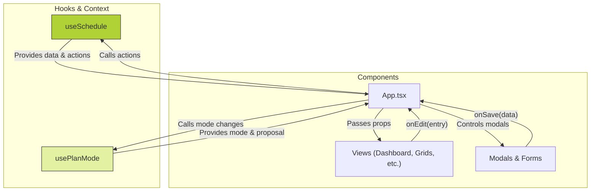

# Schedule Manager

A sophisticated and feature-rich web application for managing teacher schedules, tracking work hours in real-time, and visualizing performance data. Built with a modern tech stack, this application provides a highly interactive and responsive user experience designed to streamline operational planning.

## ✨ Features

*   **Interactive Weekly Schedule:** A responsive grid displaying all classes and work shifts.
*   **Real-time Check-in/Check-out:** Teachers can clock in and out, with their status and work duration updated live.
*   **Live Performance Dashboard:** The performance dashboard updates in real-time, reflecting hours from both completed and currently active work sessions.
*   **Unplanned Work Logging:** Automatically creates schedule entries for check-ins that don't align with a planned class, ensuring all work is visually accounted for.
*   **Rich Data Editing:** In-place time editing via popovers and detailed editing via modals.
*   **Light & Dark Mode:** A sleek, modern UI with a user-toggleable dark theme.
*   **✨ NEW: PlanMode - Strategic Planning Layer:** A new mode that transforms the application into a proactive planning platform.
    *   **Schedule Proposals:** Create, manage, and analyze multiple draft schedules without impacting the live operational view.
    *   **Capacity Profiles:** Define detailed availability, constraints, and preferences for each teacher.
    *   **Predictive Analytics:** Real-time conflict analysis and workload balancing for proposed schedules.

---

## 🚀 Getting Started

This is a client-side single-page application. No build step is required.

1.  Clone the repository.
2.  Open the `index.html` file in your web browser.

---

## 🛠️ Technology Stack

*   **Frontend Library:** React
*   **Language:** TypeScript
*   **Styling:** Tailwind CSS (configured directly in `index.html`).
*   **Charts:** Recharts for data visualization.
*   **Icons:** A custom set of SVG icons as React components.
*   **State Management:** A custom React hook (`useSchedule`) serves as the centralized state management solution, complemented by a `PlanModeContext`.

---

## 📂 File Structure

The project is organized to promote separation of concerns, making it scalable and maintainable.

```
/
├── components/      # Reusable React components
├── hooks/           # Custom React hooks for state and logic
├── services/        # Data fetching and business logic
├── index.html       # Main HTML entry point
├── index.tsx        # React application root
├── types.ts         # TypeScript type definitions
└── README.md        # You are here
```

---

## 🎨 UI/UX Design Philosophy

The application's design is driven by a focus on clarity, efficiency, and a modern aesthetic. It features a dark-first, high-contrast design, is fully responsive, and uses progressive disclosure (popovers, modals) to manage complexity.

---

## ⚙️ In-Depth Architecture

The application is architected to be robust and scalable, built on a clear separation of the view, state management, and service layers.

### The API Service Layer (`services/api.ts`)

This file acts as the **single source of truth** for all data interactions, simulating a backend API. Components and hooks call functions from `api.ts` to perform data operations.

### State Management

*   **`useSchedule` Hook**: The "brain" of the application, it encapsulates all client-side state (teachers, schedule, work logs, and now all PlanMode data) and the logic for mutating it. It handles loading/error states and performs memoized calculations for performance.
*   **`usePlanMode` Hook & Context**: Manages the application's mode (`operational` vs. `planning`) and the currently active `ScheduleProposal`.

### Uni-directional Data Flow

The application strictly follows React's uni-directional data flow model. State flows down from hooks to components as props, and events flow up from components to hooks via callbacks.



---

## 🧬 Operational Data Guide

The application's logic revolves around a set of interconnected data structures defined in `types.ts`.

### Core Data Models

*   **`ScheduleEntry`**: Represents a **planned** block of time.
*   **`WorkLog`**: Represents an **actual** period of work. It is the source of truth for calculating worked hours.
*   **`ScheduleProposal` (PlanMode)**: A draft version of a schedule. All changes in PlanMode are made to a proposal.
*   **`CapacityProfile` (PlanMode)**: Defines a teacher's availability and work constraints for validation in PlanMode.

This clear separation and linking mechanism ensures that the schedule grid always provides a complete picture of both planned and actual activities, while the dashboard's performance metrics are accurately derived from the `WorkLog` data.
