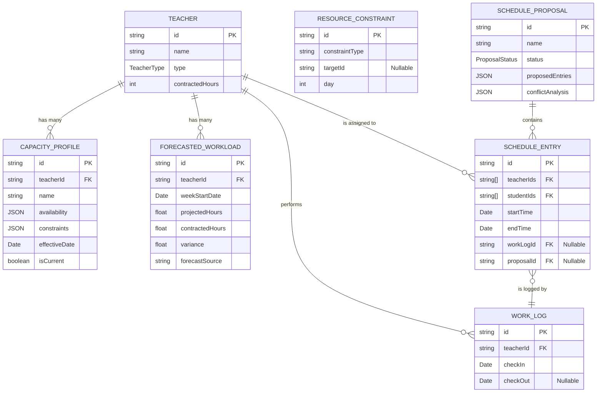
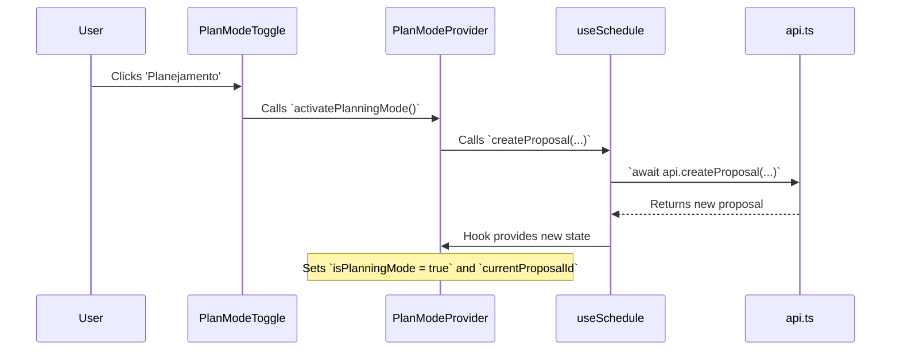
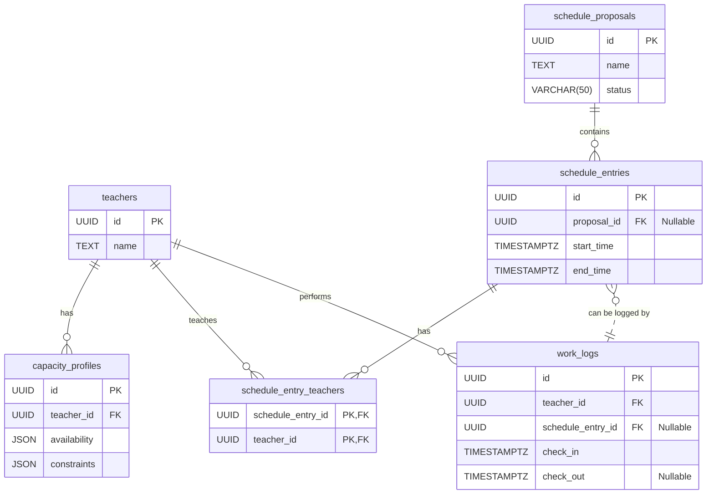

# Data Operations and Architecture Guide

This document provides an in-depth explanation of the data models, state management, and data flow within the Schedule Manager application. It serves as a technical reference for understanding how data is handled from the mock API layer to the UI components.

## 1. Core Data Models & Schema

The entire application operates on a set of well-defined TypeScript types located in `types.ts`. These types serve as the schema for our application's data.

### Main Entities

-   **`Teacher`**: Represents an instructor. Includes `id`, `name`, `type` (`Titular` or `Auxiliar`), and `contractedHours`.
-   **`Student`**: Represents a student who can be enrolled in classes.
-   **`ScheduleEntry`**: A planned event on the calendar. This is the central model for the schedule grid. It can be a recurring class or a one-off event. Critically, it can be linked to a `WorkLog`.
-   **`WorkLog`**: The source of truth for actual work performed. Created on `checkIn` and finalized on `checkOut`. This data drives the performance dashboard.
-   **`Announcement`**: A message broadcast to users.
-   **`PriorityList` & `ShiftRoster`**: Configuration objects that define teacher roles and shift assignments.

### PlanMode Entities

- **`ScheduleProposal`**: A draft version of a schedule. All changes in PlanMode are made to a proposal, leaving the live schedule untouched until the proposal is approved.
- **`CapacityProfile`**: Defines a teacher's availability, work constraints (e.g., max hours), and preferences, used for automated validation in PlanMode.
- **`ForecastedWorkload`**: Stores projected work hours for a teacher for a given week, used in strategic planning.
- **`ResourceConstraint`**: Defines constraints on resources like rooms or equipment.

### Data Model Entity-Relationship Diagram (ERD)

This diagram shows the relationships between the core data models, including the new PlanMode entities.



---

## 2. Mock API Service (`services/api.ts`)

The `services/api.ts` file acts as a **simulated backend**. It encapsulates all data and the logic to mutate it, mimicking how a real-world API would function.

-   **Data Encapsulation**: All application data (`teachers`, `scheduleEntries`, `workLogs`, and all **PlanMode** data) is stored as `let` variables within this file, inaccessible from the outside except through the exported `api` object.
-   **Asynchronous Simulation**: Every function is `async` and uses a `delay` to simulate network latency. This forces the UI to be built with loading states in mind.
-   **Immutable Operations**: When data is updated (e.g., `updateEntry`), the functions return new objects/arrays (`{...entry}`, `[...scheduleEntries]`) rather than modifying the existing ones in place. This prevents side effects and aligns with React's state management principles.
-   **Business Logic**: Complex logic, such as creating an "unplanned" `ScheduleEntry` during a check-in, is handled within this service layer, keeping the UI components clean.

---

## 3. State Management (`hooks/useSchedule.ts`)

The `useSchedule` hook is the **single source of truth for the application's client-side state**. It fetches the initial data from the API and provides components with both the data and the functions to update it.

-   **Centralization**: It manages `teachers`, `schedule`, `workLogs`, `proposals`, `capacityProfiles`, etc., in one place.
-   **Interaction with API**: It calls methods from `services/api.ts` to perform CRUD operations.
-   **Derived State**: It uses `useMemo` to efficiently compute derived data like `workloadData` (for the operational dashboard) and `planningAnalysis` (for PlanMode) without re-running expensive calculations on every render.

---

## 4. Key Data Workflows & Component Interactions

### Workflow 1: Teacher Check-in (Operational Mode)

This is a core workflow that involves linking planned schedules with actual work.

```mermaid
graph TD
    A[User clicks Check-in on `WorkLogPanel`] --> B{`App.tsx` calls `checkIn(teacherId, now)`};
    B --> C{`useSchedule` hook calls `api.checkIn(...)`};
    C --> D{`api.ts`: Create new `WorkLog`};
    D --> E{`api.ts`: Search `scheduleEntries` for an entry where:<br/>1. `teacherId` matches<br/>2. `checkInTime` is within `startTime` and `endTime`<br/>3. `workLogId` is null};
    E --> F{Match Found?};
    F -- Yes --> G{`api.ts`: Update found `ScheduleEntry` with `workLogId`};
    F -- No --> H{`api.ts`: Create a *new* `ScheduleEntry` with `isUnplanned: true` and link `workLogId`};
    G --> I{`useSchedule`: Update `workLogs` and `schedule` state};
    H --> I;
    I --> J[UI re-renders with live status and updated schedule];
```

### Workflow 2: Creating a New Schedule Proposal (PlanMode)

This workflow shows how a user enters planning mode and begins editing a new schedule draft.



---
## 5. Performance & Optimization Strategies

To ensure a smooth and responsive UI, several optimization techniques are employed.

-   **Memoization with `useMemo`**: Expensive calculations are wrapped in `useMemo` to prevent them from running on every render. This is critical for:
    -   `workloadData` in `useSchedule`: This calculation iterates over all teachers and work logs.
    -   `planningAnalysis` in `useSchedule`: The complex validation of a schedule proposal against capacity profiles is memoized.
    -   `entriesByDay` in `ScheduleGrid`: Re-calculating the layout for overlapping events is costly.

-   **Component Memoization with `React.memo`**: Presentational components that receive potentially complex props are wrapped in `React.memo`. `ScheduleEntryCard` is a prime example.

-   **Callback Memoization with `useCallback`**: Functions passed down as props are wrapped in `useCallback`. This is essential for `React.memo` to work correctly.

-   **State Colocation**: Global state is managed in `useSchedule`, but UI-specific state is kept local to the component that needs it.

---

## 6. Production Database Model (Conceptual)

To move this application to production, the mock data would be replaced by a relational database. The following schema is a logical starting point.

### Production ERD


