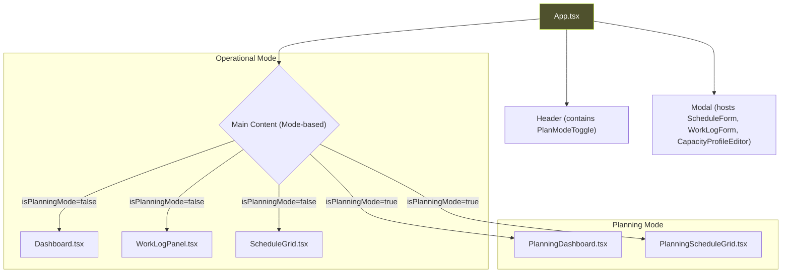

# UI Component Documentation

This document provides a complete and detailed breakdown of every React component used in the Schedule Manager application. It serves as a technical reference for understanding the purpose, props, and internal logic of the UI layer.

## Component Philosophy

The application's frontend is built on a philosophy of creating reusable, single-purpose components.

-   **Separation of Concerns**: "Smart" container components (`App.tsx`) handle logic and state, while "dumb" presentational components (`ScheduleEntryCard.tsx`) are only responsible for rendering UI based on the props they receive.
-   **Consistency**: A standardized set of popover and picker components (`CalendarPopover`, `WheelTimePicker`, etc.) ensures a consistent and high-quality user experience for all date and time interactions.
-   **Reusability**: Components like `Modal.tsx` and `SortableTable.tsx` are designed to be generic and reusable across the application.

## Component Hierarchy

This diagram illustrates how the main components are structured and nested within the application.

---

## 1. Core Application & Layout

### `App.tsx`
-   **Purpose**: The root component and central orchestrator. It fetches all data via `useSchedule`, manages top-level UI state (like modal visibility), and conditionally renders views based on the `appMode` from the `usePlanMode` hook.
-   **Dependencies**: `useSchedule`, `usePlanMode`, `PlanModeToggle`, `Dashboard`, `ScheduleGrid`, `PlanningDashboard`, `PlanningScheduleGrid`, etc.

### `hooks/usePlanMode.tsx`
-   **Purpose**: Provides the `PlanModeContext` and the `usePlanMode` hook. It manages the `isPlanningMode` state and orchestrates the creation of new `ScheduleProposals` when entering the mode.

### `components/Modal.tsx`
-   **Purpose**: A generic, reusable modal/dialog component. It is used to host all form components.

---

## 2. Main Views & Components

### `components/PlanModeToggle.tsx`
-   **Purpose**: The UI switch to toggle between 'Operational' and 'Planning' modes.
-   **Key Logic**: Uses the `usePlanMode` hook to call `activatePlanningMode` and `deactivatePlanningMode`.

### `components/Dashboard.tsx`
-   **Purpose**: Renders the **operational** dashboard, showing real-time workload data.
-   **Dependencies**: `recharts`.

### `components/PlanningDashboard.tsx`
-   **Purpose**: Renders the **planning** dashboard, a more complex view for analyzing `ForecastedWorkload` and schedule balance for a given proposal.
-   **Dependencies**: `recharts`, `usePlanMode`, `useSchedule`.

### `components/ScheduleGrid.tsx`
-   **Purpose**: Renders the **operational** weekly schedule.
-   **Key Logic**: Displays the live schedule from `useSchedule`. Handles interactions for editing existing entries.

### `components/PlanningScheduleGrid.tsx`
-   **Purpose**: Renders the **planning** schedule.
-   **Key Logic**: Displays the `proposedEntries` from the `activeProposal`. Highlights conflicts and issues identified by `planningAnalysis` from the `useSchedule` hook.

### `components/DataTableView.tsx`
-   **Purpose**: Provides a "raw data" view of all the application's data models in sortable tables.

---

## 3. Forms & Modals

### `components/ScheduleForm.tsx`
-   **Purpose**: A comprehensive form for creating and editing `ScheduleEntry` objects.

### `components/WorkLogForm.tsx`
-   **Purpose**: A specialized form for adding or editing a manual `WorkLog`.

### `components/CapacityProfileEditor.tsx`
-   **Purpose**: A new, detailed form for creating and editing a teacher's `CapacityProfile` in PlanMode.
-   **Key Logic**: Manages a complex local state for a teacher's weekly availability and work constraints.

---

## 4. Popover & Picker Components

This suite of components provides a standardized, theme-aware replacement for native browser date/time inputs.

-   **Popover Containers**: `TimeEditorPopover.tsx`, `CalendarPopover.tsx`, `WheelTimePickerPopover.tsx` manage positioning and visibility.
-   **Picker Widgets**: `ElegantCalendar.tsx` and `WheelTimePicker.tsx` are the actual input widgets.

---

## 5. Atomic Components

### `components/icons.tsx`
-   **Purpose**: A single file that exports all SVG icons used in the application as individual, self-contained React components.

This comprehensive component architecture enables rapid development, easy maintenance, and a consistent, high-quality user experience across the entire application.
